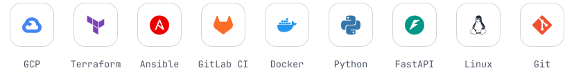

  <picture>
    <source media="(prefers-color-scheme: dark)" srcset="assets/banner-dark.svg">
    
  </picture>

  <a href="https://ahmedbrini.vercel.app/"><picture><source media="(prefers-color-scheme: dark)" srcset="assets/btn-portfolio-dark.svg"></picture></a>&nbsp;
  <a href="https://www.linkedin.com/in/ahmedbrini/"><picture><source media="(prefers-color-scheme: dark)" srcset="assets/btn-linkedin-dark.svg"></picture></a>&nbsp;
  <a href="https://gitlab.com/brinidev"><picture><source media="(prefers-color-scheme: dark)" srcset="assets/btn-gitlab-dark.svg"></picture></a>&nbsp;
  <a href="mailto:ahmed.brini.abr@gmail.com"><picture><source media="(prefers-color-scheme: dark)" srcset="assets/btn-email-dark.svg"></picture></a>

  I automate infrastructure and deployments on Google Cloud with <b>Terraform</b>, <b>Ansible</b> and <b>GitLab CI/CD</b>. 
  Final-year software engineering student at MedTech, Tunis · Open to a capstone internship (PFE) from January 2027

  <picture>
    <source media="(prefers-color-scheme: dark)" srcset="assets/tools-dark.svg">
    
  </picture>

<a href="https://gitlab.com/brinidev/gcp-delivery-pipeline">
  <picture>
    <source media="(prefers-color-scheme: dark)" srcset="assets/project-pipeline-dark.svg">
    
  </picture>
</a>

<a href="https://github.com/sinex-cloud/infrastructure-terraform-gcp">
  <picture>
    <source media="(prefers-color-scheme: dark)" srcset="assets/project-terraform-dark.svg">
    
  </picture>
</a>

